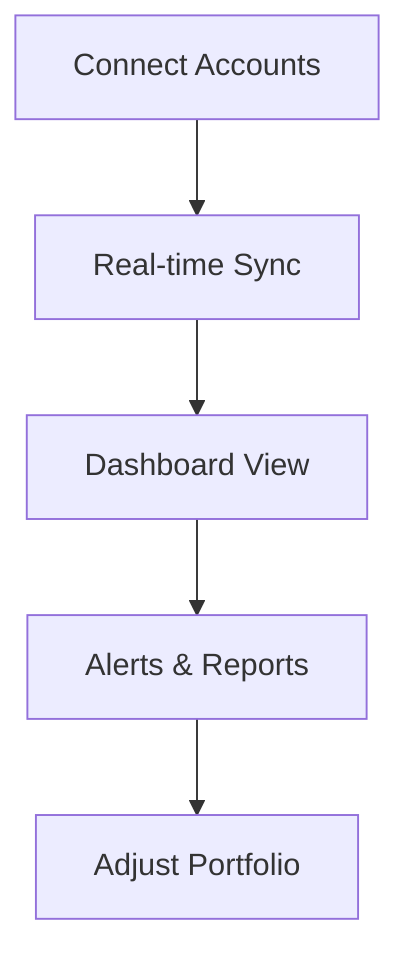

## Overview

Tima empowers you to make smarter financial decisions with tools for investments, portfolio management, analysis, education, and personalization. Access diverse opportunities while tracking performance in real-time. Dive into features that fit your financial goals.

<Columns cols={3}>
  <Card title="Investment Options" icon="trending-up" href="#investment-options">
    Explore stocks, bonds, and funds tailored to your risk profile.
  </Card>
  <Card title="Portfolio Tracking" icon="bar-chart-3" href="#portfolio-tracking">
    Monitor your assets with intuitive dashboards and alerts.
  </Card>
  <Card title="Financial Analysis" icon="activity" href="#financial-analysis">
    Get insights from charts, reports, and predictive tools.
  </Card>
  <Card title="User Support" icon="help-circle" href="#user-support">
    Access guides, tutorials, and 24/7 assistance.
  </Card>
  <Card title="Customization" icon="sliders" href="#customization">
    Tailor views, notifications, and strategies to your needs.
  </Card>
</Columns>

## Investment Options

Choose from curated investment vehicles. Tima supports stocks, ETFs, bonds, and crypto with low fees and global access.

<Tabs>
  <Tab title="Stocks & ETFs" icon="trending-up">
    Invest in major exchanges like NYSE and NASDAQ.
    
    ```javascript
    // Fetch available stocks
    const response = await fetch('https://api.example.com/v1/investments/stocks', {
      headers: { Authorization: `Bearer ${YOUR_API_KEY}` }
    });
    const stocks = await response.json();
    ```
  </Tab>
  <Tab title="Bonds" icon="link">
    Secure fixed-income options with maturity tracking.
    
    ```javascript
    // Query bond yields
    const bonds = await fetch('https://api.example.com/v1/investments/bonds');
    ```
  </Tab>
  <Tab title="Crypto" icon="bitcoin">
    Trade popular cryptocurrencies with real-time pricing.
  </Tab>
</Tabs>

<Callout kind="tip">
  Start with diversified ETFs for balanced risk. Review geographical restrictions in your account settings.
</Callout>

## Portfolio Tracking

Track your portfolio effortlessly with these steps.

<Steps>
  <Step title="Connect Accounts" icon="link">
    Link your brokerage accounts via OAuth.
  </Step>
  <Step title="View Dashboard" icon="bar-chart-3">
    Access real-time net worth and asset allocation.
  </Step>
  <Step title="Set Alerts" icon="bell">
    Configure notifications for price changes `{>10%}` or dividends.
  </Step>
</Steps>



## Financial Analysis Resources

Leverage powerful tools for data-driven decisions.

<CodeGroup tabs="JavaScript,Python">
```javascript
// Analyze portfolio performance
const analysis = await fetch('https://api.example.com/v1/analysis/portfolio', {
  method: 'POST',
  body: JSON.stringify({ symbols: ['AAPL', 'GOOGL'] })
});
```
```python
import requests
response = requests.post('https://api.example.com/v1/analysis/portfolio',
                        json={'symbols': ['AAPL', 'GOOGL']})
```
</CodeGroup>

| Metric          | Description                  | Endpoint                  |
|-----------------|------------------------------|---------------------------|
| Sharpe Ratio   | Risk-adjusted return        | `/analysis/sharpe`       |
| Beta           | Market volatility measure   | `/analysis/beta`         |
| Dividend Yield | Annual payout percentage    | `/analysis/dividends`    |

## User Support and Educational Content

<ExpandableGroup>
  <Expandable title="Getting Started Guides" default-open="true">
    Video tutorials cover basics like account setup and first investments. Access via dashboard under `Help`.
  </Expandable>
  <Expandable title="Live Support">
    Chat with experts 24/7. Use `/support/tickets` API for programmatic queries.
  </Expandable>
  <Expandable title="Webinars & Courses">
    Monthly sessions on advanced topics like tax optimization.
  </Expandable>
</ExpandableGroup>

## Customization for User Preferences

Personalize your Tima experience. Set themes, notification thresholds, and widget layouts.

<Callout kind="info">
  Save preferences via `PUT /v1/user/preferences` with JSON payload like `{theme: "dark", alerts: {volatility: 5}}`.
</Callout>

```javascript
// Update preferences
await fetch('https://api.example.com/v1/user/preferences', {
  method: 'PUT',
  headers: { 'Content-Type': 'application/json' },
  body: JSON.stringify({
    theme: 'dark',
    alerts: { price_change: '>5%' }
  })
});
```

These features integrate seamlessly, helping you build and manage wealth effectively. Explore [quickstart](/quickstart) for hands-on setup.